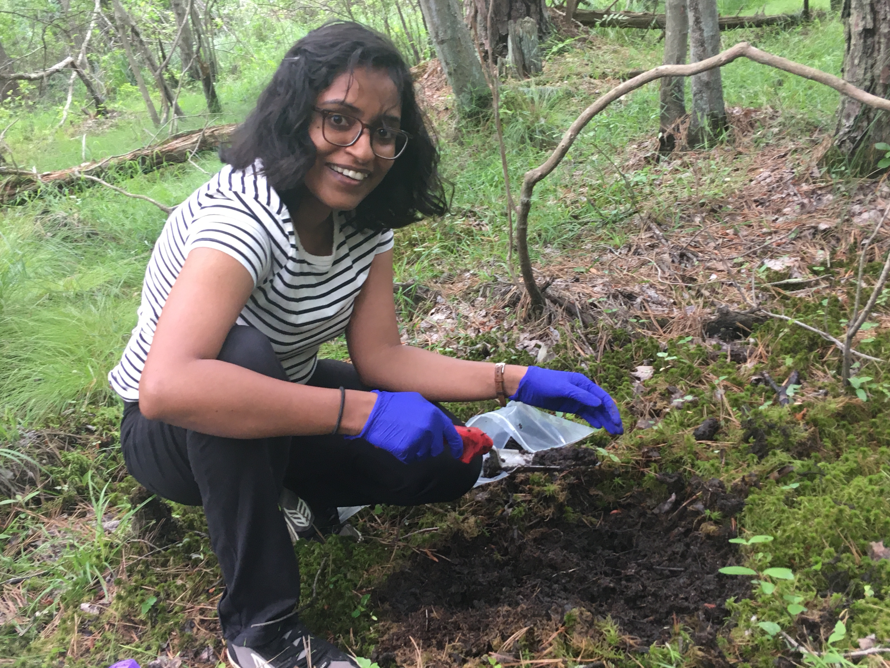

## Welcome to my personal research website!

I am a molecular microbial ecologist and a biogeochemist studying how microbial communities interact and co-evolve with the earth’s biogeochemical cycles.

||
|:--:|
|*Sampling peat in the New Jersey Pine Barrens (Summer 2023).*|

Currently, I am a Postdoctoral Research Associate in the [Department of Geosciences](https://geosciences.princeton.edu/people/linta-reji#:-:text=linta%20reji) at Princeton University. 
I received my Ph.D. from the department of [Earth System Sciences](https://earthsystemscience.stanford.edu/), and B.S. (Honors) from the [Earth Systems Program](https://earthsystems.stanford.edu/) at Stanford University.

### In July 2024, I will start an independent research group in the [Department of Geophysical Sciences](https://geosci.uchicago.edu/people/linta-reji/) at the University of Chicago.

_**Opportunities are available at all levels to join the group (graduate students, postdocs, and research technicians). [Contact](mailto:lreji@princeton.edu) to find out more!**_
